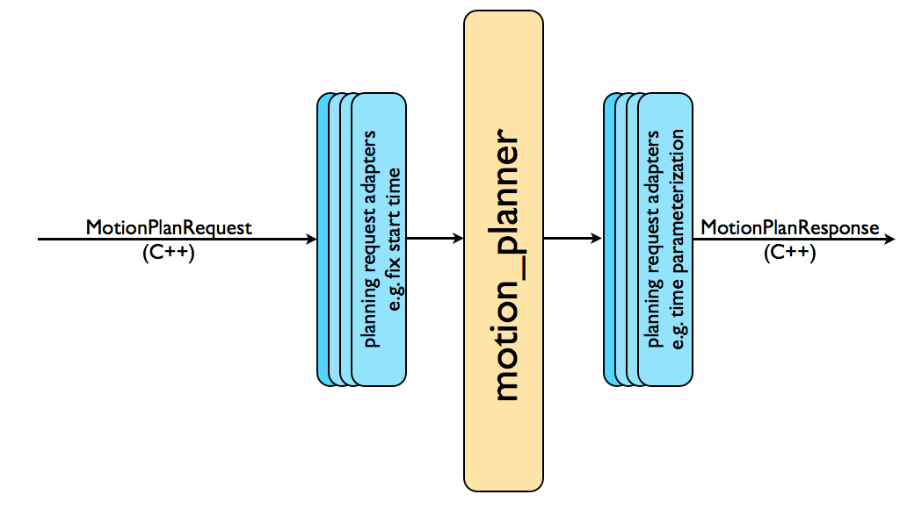

# MoveIt - motion planning plugin

MoveIt works with motion planners through a plugin interface. This allows MoveIt to communicate with and use different motion planners from multiple libraries, making MoveIt easily extensible. The interface to the motion planners is through a ROS Action or service (offered by the `move_group` node). 

Planners available in MoveIt are (descending order of popularity/support within MoveIt):
- [Open Motion Planning Library (OMPL)](moveit_OMPL.md)

- **Pilz Industrial Motion Planner**, a deterministic generator for circular and linear motions. Additionally, it supports blending multiple motion segments together using a MoveIt capability.

- **Stochastic Trajectory Optimization for Motion Planning (STOMP)**, an optimization-based motion planner based on the PI^2 (Policy Improvement with Path Integrals, Theodorou et al, 2010) algorithm. It can plan smooth trajectories for a robot arm, avoiding obstacles, and optimizing constraints. The algorithm does not require gradients, and can thus optimize arbitrary terms in the cost function like motor efforts. Partially supported. 

- **Search-Based Planning Library (SBPL)**, a generic set of motion planners using search based planning that discretize the space. Integration into latest version of MoveIt is work in progress.

- **Covariant Hamiltonian Optimization for Motion Planning (CHOMP)**, a novel gradient-based trajectory optimization procedure that makes many everyday motion planning problems both simple and trainable (Ratliff et al., 2009c). While most high-dimensional motion planners separate trajectory generation into distinct planning and optimization stages, this algorithm capitalizes on covariant gradient and functional gradient approaches to the optimization stage to design a motion planning algorithm based entirely on trajectory optimization. Given an infeasible naive trajectory, CHOMP reacts to the surrounding environment to quickly pull the trajectory out of collision while simultaneously optimizing dynamical quantities such as joint velocities and accelerations. It rapidly converges to a smooth collision-free trajectory that can be executed efficiently on the robot. Integration into latest version of MoveIt is work in progress.

## The Motion Plan Request

The motion plan request specifies what you would like the motion planner to do. Typically, you will be asking the motion planner to move an arm to a different location (in joint space) or the end-effector to a new pose. Collisions are checked for by default (including self-collisions and attached objects). You can also specify the planner via the `planning_pipeline` and `planner_id` parameters, and the constraints for the motion planner to check - the inbuilt constraints provided by MoveIt are kinematic constraints:

- **Position constraints**: restrict the position of a link to lie within a region of space.

- **Orientation constraints**: restrict the orientation of a link to lie within specified roll, pitch or yaw limits.

- **Visibility constraints**: restrict a point on a link to lie within the visibility cone for a particular sensor.

- **Joint constraints**: restrict a joint to lie between two values.

- **User-specified constraints**: it is also possible to specify your own constraints with a user-defined callback.

## The Motion Plan Result

The `move_group` node will generate a desired trajectory in response to your motion plan request. This trajectory will move the arm (or any group of joints) to the desired location. Note that the result coming out of `move_group` is a trajectory and not just a path. `move_group` will use the desired maximum velocities and accelerations (if specified) to generate a trajectory that obeys velocity and acceleration constraints at the joint level.

## Motion planning adapters



The complete motion planning pipeline chains together a motion planner with other components called **planning request adapters**. Planning request adapters allow for pre-processing motion plan requests and post-processing motion plan responses. Pre-processing is useful in several situations, e.g. when a start state for the robot is slightly outside the specified joint limits for the robot. Post-processing is needed for several other operations, e.g. to convert paths generated for a robot into time-parameterized trajectories. MoveIt provides a set of default motion planning adapters that each perform a very specific function:

| Adapter                          | Description|
|----------------------------------|-----------------------------------------------------------------------------------------------------------------------------------------------------------------------------------------------------------------------------------------------------------------------------------------------------------------------------------------------------------------------------------------------------------------------------------------------------------------------------|
| **FixStartStateBounds**  | Fixes the start state to be within the joint limits specified in the URDF. If the robot is physically outside joint limits, motion planner is unable to plan since it will think that the starting state is outside joint limits.  A parameter for the adapter specifies how much the joint can be outside its limits for it to be “fixable”.|
| **FixWorkspaceBounds** | Specify a default workspace for planning: a cube of size 10 m x 10 m x 10 m. This workspace will only be specified if the planning request to the planner does not have these fields filled in.|
| **FixStartStateCollision**   | It will attempt to sample a new collision-free configuration near a specified configuration (in collision) by perturbing the joint values by a small amount. The amount that it will perturb the values by is specified by the  jiggle_fraction parameter that controls the perturbation as a percentage of the total range of motion for the joint. The other parameter for this adapter specifies how many random perturbations the adapter will sample before giving up. |
| **FixStartStatePathConstraints** | Applied when the start state for a motion plan does not obey the specified path constraints. It will attempt to plan a path between the current configuration of the robot to a new location where the path constraint is obeyed. The new location will serve as the start state for planning.|
| **AddTimeParameterization**  | The motion planners will typically generate “kinematic paths”, i.e., paths that do not obey any velocity or acceleration constraints and are not time parameterized. This adapter will “time parameterize” the motion plans by applying velocity and acceleration constraints. |
| **ResolveConstraintFrames**  | Goal constraints can be set using subframes (e.g. a pose goal in the frame cup/handle, where handle is a subframe on the object cup). This adapter changes the frame of constraints to an object or robot frame (e.g. cup).|

## MoveIt planners

```{toctree}
---
maxdepth: 2

---

moveit_OMPL
```