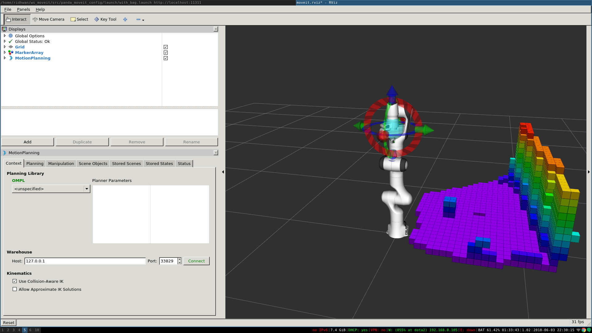

# Perception Pipeline

MoveIt allows for seamless integration of 3D sensors using Octomap. Once properly configured, you should see something like this in rviz:




## Configuration

In this section, we will walk through configuring the 3D sensors on your robot with MoveIt. The primary component in MoveIt that deals with 3D perception is the Occupancy Map Updater. The updater uses a plugin architecture to process different types of input. The currently available plugins in MoveIt are:

* The PointCloud Occupancy Map Updater: which can take as input point clouds (`sensor_msgs/PointCloud2`)
* The Depth Image Occupancy Map Updater: which can take as input Depth Images (`sensor_msgs/Image`)


## YAML Configuration file (Point Cloud)

We will have to generate a YAML configuration file for configuring the 3D sensors. Please see [this](https://github.com/ros-planning/panda_moveit_config/blob/kinetic-devel/config/sensors_kinect_pointcloud.yaml) example file for processing point clouds, located in the [panda_moveit_config repository](https://github.com/ros-planning/panda_moveit_config) for Kinetic. Save this file in the config folder in the robot’s moveit_config package with name “sensors_kinect_pointcloud.yaml”:

```
sensors:
  - sensor_plugin: occupancy_map_monitor/PointCloudOctomapUpdater
    point_cloud_topic: /camera/depth_registered/points
    max_range: 5.0
    point_subsample: 1
    padding_offset: 0.1
    padding_scale: 1.0
    max_update_rate: 1.0
    filtered_cloud_topic: filtered_cloud
```

**The general parameters are:**

    sensor_plugin: The name of the plugin that we are using.
    max_update_rate: The octomap representation will be updated at rate less than or equal to this value.

**Parameters specific to the Point cloud updater are:**

    point_cloud_topic: This specifies the topic to listen on for a point cloud.
    max_range: (in m) Points further than this will not be used.
    point_subsample: Choose one of every point_subsample points.
    padding_offset: The size of the padding (in cm).
    padding_scale: The scale of the padding.
    filtered_cloud_topic: The topic on which the filtered cloud will be published (mainly for debugging). The filtering cloud is the resultant cloud after self-filtering has been performed.

```{warning}
Credo non lo faremo mai, se vuoi continuare la guida segui la [documentazione ufficiale](http://docs.ros.org/en/kinetic/api/moveit_tutorials/html/doc/perception_pipeline/perception_pipeline_tutorial.html) (ROS1 only) 
``` 