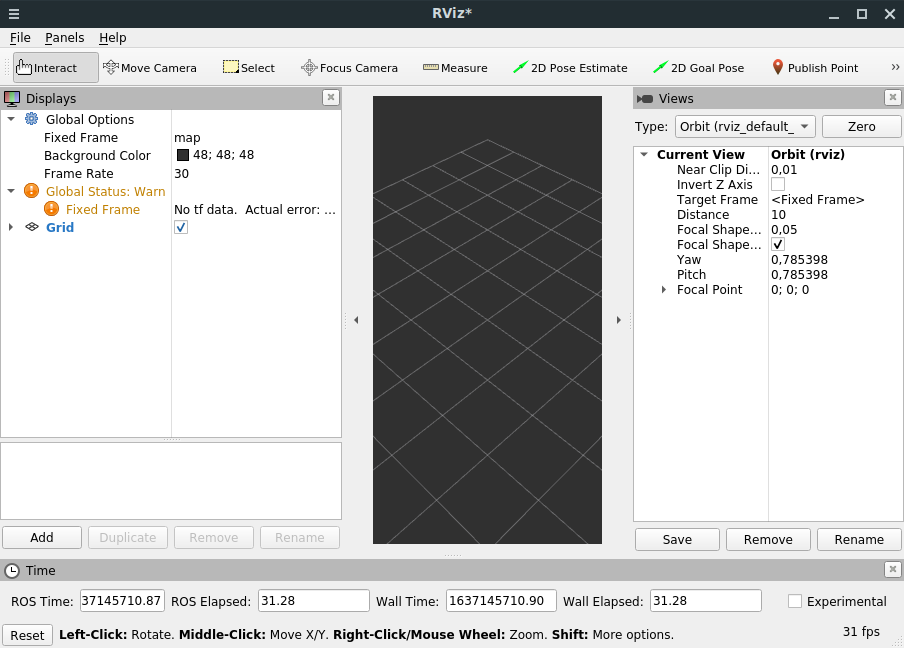
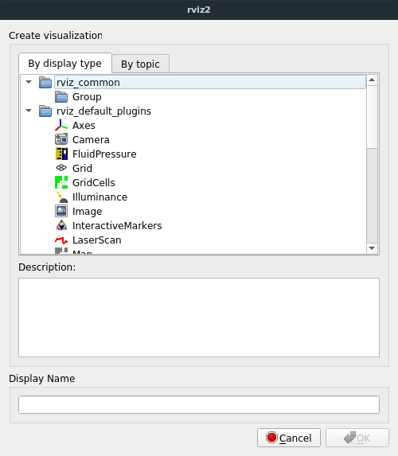
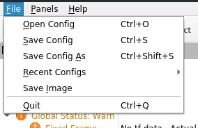
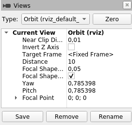
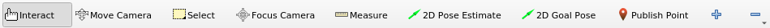

# RViz
- [RViz](#rviz)
- [RViz Interface](#rviz-interface)
  - [Displays](#displays)
  - [Configurations](#configurations)
  - [Views](#views)
  - [Frames](#frames)
  - [Tools](#tools)
- [Using RViz #TODO](#using-rviz-todo)

[`rviz`](http://wiki.ros.org/rviz/UserGuide) is a 3D visualization environment. It's a powerful tool for debugging ROS applications. Run RViz through:
```sh
$ ros2 run rviz2 rviz2
```

## RViz Interface


### Displays
A display is something that draws in the 3D world (e.g. the robot state). Each display has its own list of **properties** and its **status** visible in the `Displays` panel. Clicking on a display property also visualize a **description** on the bottom.

To add a display, click the `Add` button in the `Displays` panel. The [**`display type`**](http://wiki.ros.org/rviz/UserGuide#Built-in_Display_Types) details what kind of data this display will visualize. The text box in the middle gives a description of the selected display type. Finally, you must give the display a **unique name**.

  



### Configurations
Different display configurations can be useful for RViz. Therefore, RViz lets us **load** and **save** different configurations.



A configuration contains:
- Displays and their properties
- Tool properties
- Camera type and settings of initial viewpoint.

### Views
There are different camera types available in the `Views` panel. They consists both of different ways to control the camera and different types of projection.



- **Orbital camera**: rotates around a focal point while always looking at it.
- **FPS (first person) camera**: rotate along camera axes
- **Top-down orthographic**: looks down along Z axis of the robot frame, with orthographic view (no perspective)
- **XY orbit**: same as orbital camera, with focus point restricted to the XY plane
- **Third person follower**: The camera maintains a constant viewing angle towards the target frame.

A view consists of:
- A **Target** [**Frame**](#frames).
- A **view configuration**: position, orientation, camera type and pose ...
- A **view controller type**.

### Frames
RViz uses [**tf**](../Standard_Libraries/tf.md#tf2) transform system for transforming data from the coordinate frame it arrives in into a global reference frame. There are two important coordinate frames in RViz:
- **Fixed Frame**: reference used to denote the "world" frame. For correct results, a fixed frame should not be moving relative to the world.
- **Target Frame**: reference for the camera view.

### Tools
Tools are visible in the toolbar:



- **Move camera**: move camera in 3D view
- **Select**: select items displayed in 3D view
- **2D pose estimate**: used to set an initial pose to seed the localization system (sent on the `/initialpose` ROS topic)
- ...


## Using RViz #TODO
There are two main ways to put data into RViz world:
1. Sensor and state information, using plugins for many kinds of available topics 
2. Visualization markers (primitive shapes)