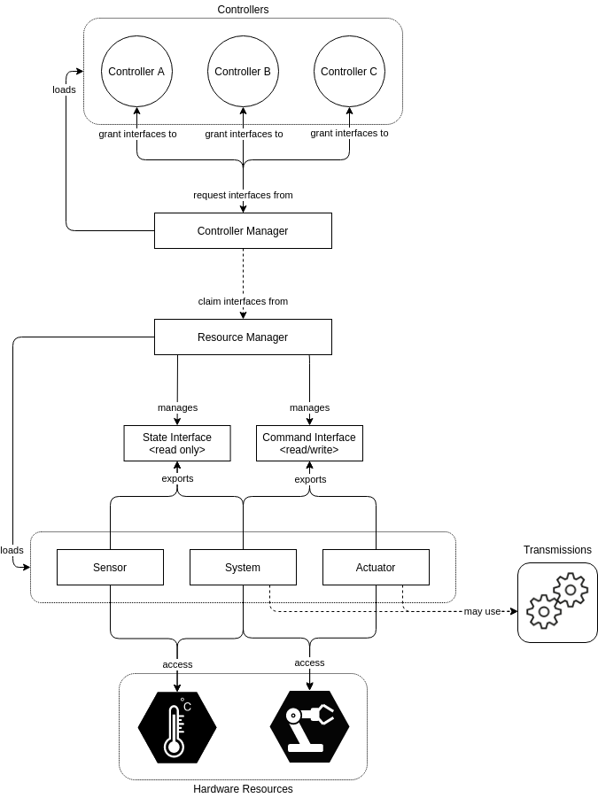

# ROS2_control
- [ROS2_control](#ros2_control)
  - [Controller manager](#controller-manager)
  - [Resource Manager](#resource-manager)
  - [Control loop](#control-loop)

The following figure shows the architecture of `ros2_control` framework:



## Controller manager
The `controller_manager` ([CM](https://github.com/ros-controls/ros2_control/blob/master/controller_manager/src/controller_manager.cpp)) has three main purposes:
1. CM connects the **controllers** and **hardware components** abstraction (through [Resource Manager](#resource-manager)).
2. CM **manages controllers**': their **lifecycle** (i.e. loading, activating, deactivating, unloading) and their **update**.
3. CM also offers ROS **services** to the ROS world and the **user**.

Parameter|description
-|-
`robot_description` [string]|String with the URDF robot description. This is usually the result of parsed files by `xacro`
`update_rate` [double]|Frequency of CM **real-time** `update()` control-loop. This loop reads data from hardware, updates all active controllers and writes commands to hardware.
[other optional parameters](http://control.ros.org/ros2_control/controller_manager/doc/userdoc.html#parameters)

There are 2 helper scripts to interact with CM at launch:
- **`spawner`**: loads, configures and start a controller on startup
  ```powershell
  $ ros2 run controller_manager spawner [-options] <controller_name>
  # -options:
  #   -p <param_file>: parameter file to be loaded into controller node before configure
  #   -t <controller_type>: type of controller. If not provided it should exist in CM namespace.
  #   --stopped: load controller without starting it
  #   ... 
  ```
- **`unspawner`**: stops and unloads a controller
  ```powershell
  $ ros2 run controller_manager unspawner [-options] <controller_name>
  ```


## Resource Manager
The `resource_manager` ([RM](https://github.com/ros-controls/ros2_control/blob/master/hardware_interface/src/resource_manager.cpp)) **abstracts physical hardware** and its drivers ([**hardware components**](ros2_control_HI.md#hardware-components)) for the `ros2_control` framework. 

RM has different purposes:
- parses the [`ros2_control` URDF](ros2_control_URDF.md) and loads/instantiate the respective logic components (i.e. `joint` and `sensor`) and HW components (`system`, `sensor` and `actuator`) using [`pluginlib`](../Standard_Libraries/pluginlib.md)-library
- manages component's **lifecycle**
- manages `state` and `command` **interfaces**. 

RM abstracts hardware resources from their logical components, such that a controller does not have to know which hardware commands which joint. It also keeps a ledger of controllers and the claimed resources, in order to distribute them. This abstraction enables re-usability of implemented hardware components, and flexible hardware application for `state` and `command` interfaces.

RM internally maintains a mapping of each individual hardware resource and their interfaces. This mapping can be indexed through a simple `_logical_component_/_interface_name_` lookup (e.g. `joint_name/position`)

In the control loop execution, the RM’s `read()` and `write()` methods deal with communication to the hardware components.

## Control loop
In the most basic form, the loop consists in:
1. **read state** from HW through `CM` -> `read()` method
2. **update** controllers through `CM` -> `update()` method
3. **write command** to HW through `CM` -> `write()` method